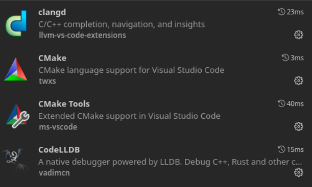
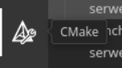
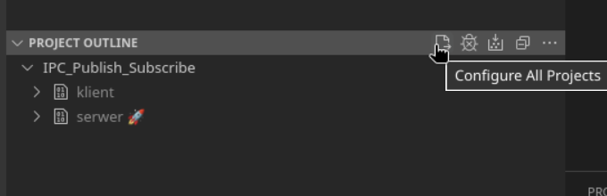
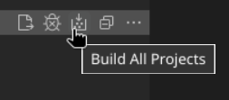
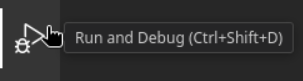
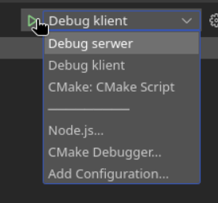
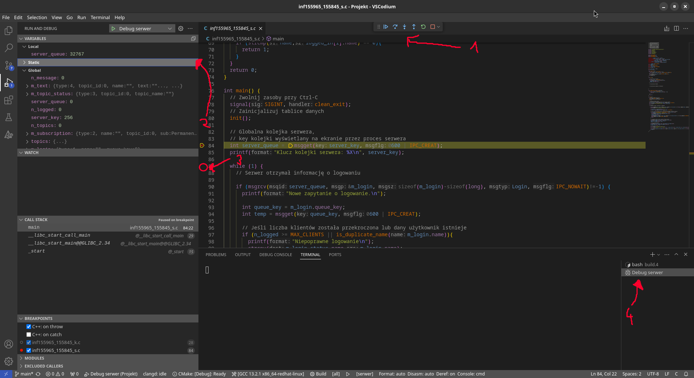

# Debugowanie w VSCode, VSCodium itp.

## Zautomatyzowane synchronizowanie z GitHub
1. Sklonuj projekt, w terminalu:
  ```bash
  git clone https://github.com/NiebieskiRekin/IPC-Publish-Subscribe
  ```
  Utworzy się nowy folder o nazwie takiej jak projekt ze wszystkimi potrzebnymi plikami.

2. Aby zsynchronizować, w terminalu:
  - bez nadpisywania własnych zmian
  ```bash
  git fetch origin
  ````

  - nadpisując własne pliki tymi z repozytorium
  ```bash
  git pull origin main
  ```

## Konfiguracja Debuggera
1. Uruchom VSCode
2. Pobierz rozszerzenia:

   

3. Zrestartuj VSCode i otwórz sklonowany folder projektu
4. Wybierz zainstalowany Kit kompilatora (powinno znaleźć automatycznie [Scan for kits])
5. Otwórz zakładkę *CMake* z paska po lewej:

   

6. W nowo otwartej karcie po najechaniu na zakładkę __PROJECT OUTLINE__ wybierz opcję `Configure all projects`

   

   Powinien powstać nowy folder *build*
7. Wybierz `Build all projects`

   

8. Otwórz zakładkę *Run and Debug* z paska po lewej:

   

9. Wybierz odpowienią configurację w zależności od programu, można wybrać wielokronie jedna po drugiej.

   

   Uruchom zielonym trójkątem lub F5.
10. Powinien uruchomić się debugger. 

   

   1. Przechodzenie do kolejnych linii kodu i sterowanie wykonywaniem kodu
   2. Podgląd na zmienne, jeśli globalne nie są widoczne to można je dodać w zakładce Watch 3. Ustawianie breakpoint na danej linii
   4. Wybór okna terminala (przydane jeśli program prosi o wpisanie danych lub coś wyświetla na stdout)
